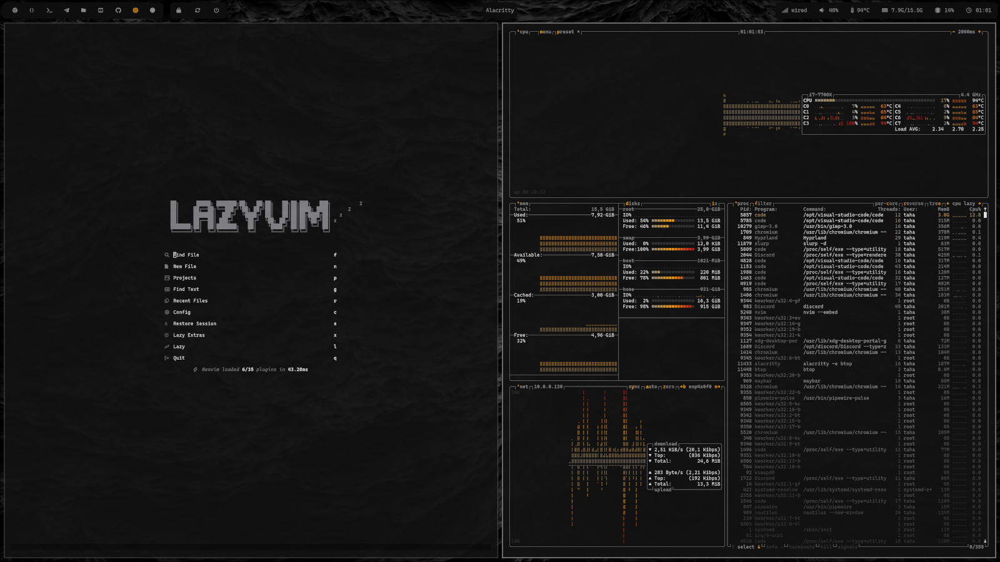

# Matte Black theme for Omarchy

A custom dark theme for Omarchy, designed to be sleek and modern with a matte black aesthetic.

## Color palette

## Installation

To install the Omarchy Matte Black theme, follow these steps:

1. Download the theme folder named ["matte-black"](./Matte%20Black%20files/matte-black/) from the repository.
2. Copy the folder to your Omarchy themes directory at: `~/.config/omarchy/themes`
3. Select the Matte Black theme by toggling themes using the keyboard shortcuts
   - `Ctrl + Shift + Super + Space`

note: You can also get the [background image](./Matte%20Black%20files/background/1-matte-black.jpg) from the repo and place it in a new folder named "matte-black" in `~/.config/omarchy/backgrounds` to use it as the background for the Matte Black theme.

## Waybar

Check out the [Waybar folder](./Waybar) for a custom setup that accompanies the Omarchy Matte Black theme.
